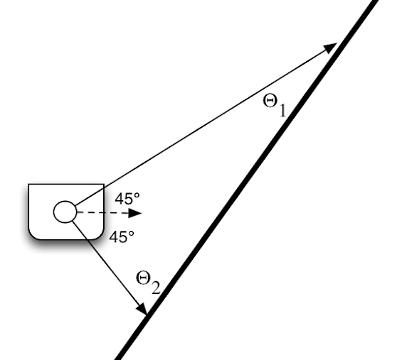

# Warmup Project
by Annabelle Platt and Kate Macowiak

## Running on the simulator: 
1. `colcon build` 
2. `ros2 launch neato2_gazebo neato_gauntlet_world.py` or `ros2 launch neato2_gazebo neato_gauntlet_no_cube_world.py`
3. `rviz2` and load the correct configuration
4. `ros2 run warmup_project script` 

## Robot Behaviors: 

### Teleop
For teleop mode we listen for key inputs and change the angular and linear velocities based on which key is pressed. The user can input a,s,d,f to control the robot, where a is forward, s is backward, d is spinning left, and f is spinning right. Hitting any other key will stop the robot motion. 

We made the decision that after a key press, the robot will continue moving in that direction until it receives new input. We recognize that this decision could have safety implications if used in a system larger than a Neato, but ultimately decided due to the complexity it would require, this state was acceptable for our learning goals in this project. We investigated writing a separate node to track key presses or using a timing based system, but decided this was beyond the scope of the project for us. 

### Driving in a square
We are using the robot's odometry to navigate in a square. This is essentially implemented as a state controller with two states, driving and turning. In the driving state, we track the robots position in x,y,z coordinates to determine when we have driven forwards 1m. We then switch to turning state, where we check the robot's angle compared to its original. Once it has turned 90 degrees from its original angle we switch back to the driving state. This will continue indefinitely, so the robot will keep driving in squares until the script is stopped. 

We decided to use odometry over a timing-based system for higher accuracy, and because we thought it would be a good challenge for our learning. We encountered some difficulties because the angle data was in a quaternion format, which is difficult to visualize. However, we got around this by converting the quaternions to Euler angles and evaluating the robot's rotation around the z-axis. 

### Wall following
For our wall follower we look at the distances measured by the lidar at angles 260 and 280 degrees in the robots coordinate frame. We then turn depending on which of those angles is larger, and continue straight if they are equal. The diagram below shows what this might look like.

We want the distance to the wall at the side corresponsing to angles theta 1 and 2 to be equal, because that means the side of the robot is parallel to the wall. In the diagram, the theta 1 side has a much longer distance to the wall than the theta 2 side, so we need to turn towards theta 1 (clockwise) to even them out. The rate of turning is proportional to the distance needed to turn. 

The diagram shows measuring the ranges at 45 degree angles on either side. However, when we ran our code with an actual Neato, we found the laser data was unreliable at 45 degrees. After some tuning, we found that 10 degrees up and down from 270 was the sweet spot. 

While our robot is a little bit swervy while accomplishing this, it sucessfully follows a wall. It can only follow in one direction, because we thought the time it would take to make a mechanism to mirror our code on the other side would be better spent on the other behaviors. It also must be placed near the wall, as it cannot approach the wall on its own. 

### Person following
Our person-following code is our most complex algorithmically. It take a full 360 degree laser scan and groups it into clusters. It uses a rolling average to see if the range of the current three points is significantly larger than the last three points. If so, it creates a new cluster. If the average distance at the next point is close enough to the average distance of the previous point, we assume they are part of the same object. If not, we assume they are part of different objects and start a new cluster for the new object. This continues all the way around. 

We then compare our cluster sizes. A larger object should take up more angles in the lidar. In the diagram below, the square cluster would span four different points while the triangle spans only one. We would therefore choose to follow the square because it is larger. We set our robot heading for halfway between the start and end angle of the cluster. 

In order to avoid following a large chunk of nothing, like the space behind the robot in the diagram, we take the average of the distances in the cluster. If the average distance is too close to zero, we discard that cluster and take the next largest. 

In turning to face our target, we want to turn quickly if we are close by so we have enough time to adjust, whereas if we are further away we can take more time to turn. We therefore made our turning speed proportional to the square root of the angle we needed to turn, as this function would give us the shape we wanted. We initially tried direct proportional control, but the Neato wouldn't turn in time at close ranges, and generally did not have a smooth trajectory.

Our linear speed is inversely proportional to the angle we are heading, because at a small angle we are turning quickly so we want to drive slowly. At a larger angle we are turning slowly so we can drive faster.

### Obstacle avoidance
We assume that the point we're trying to get to is in the direction of our initial heading. The robot will go straight until the lidar detects an object ahead. It will turn 90 degrees, drive straight until it no longer detects that object on its side, then rotate back 90 degrees. Because, given multiple obstacles, this would result in the robot heading further and further away from its initial line (see A in the diagram below), we alternate the direction of turning with each obstacle, making a sort of slalom (B in the diagram). 

One drawback of this approach is that shapes must be rectangular. If they are circular, the robot may approach, rotate 90 degrees, think the object is gone, and rotate back. However, if it has not gone all the way past, it may turn again to avoid the obstacle. Since the direction of turning is now flipped, this would cause it to turn directly into the obstacle (C in the diagram). We chose to make essentially a slalom robot, but we recognize that this is a limitation of our approach. 

### Finite state control
We decided to implement a new behavior for the Neato, which we are calling "Attack Neato". There are three states to this behavior. First, the Neato circles until it detects prey (an object in its vicinity). Once it detects prey, it will speed towards the object until it is has hit the object (is within a certain distance). Once it has hit, it will speed backwards until it has travelled a certain distance. This distance is far enough that if the object does not move, the robot will not detect it again. It will then go back to circling until it detects another threat. 

The behaviors can be visualized with the following diagram: 

The state diagram is as follows: 

One decision that we made was to move in a circle rather than just spin in place. We decided that this behavior would appear more anthropomorphic. We also decided to only search for targets in front of the robot, simulating a real creature that cannot see all the way around itself.  

## Code Structure
Each behavior is implemented with a class that inherits from the Node class. In our person-following implementation we created a helper class for the clusters detected by the lidar, because we wanted to store properties like which angle the clusters started and stopped at and what the values inside were. This also allowed us to use handy methods that adjusted for any offsets, so we didn't have to, for example, remember to subtract a certain number from every measurement. 

## Challenges
* Visualizations
    * We had a lot of trouble getting visualizations to show up in RViz. We got it to work by publishing to the incorrect frame. However, we didn't realize how frames work, so this meant our visualization was relative to the robot, rather than the global coordinate system. Eventually (with help) we figured out that a discrepancy in timing between frames was the problem, but if we had been able to use visualization properly we might have been able to troubleshoot more effectively.
* Poor code structure
    * Our person following code was seeing some strange problems for a long time. The robot was heading in the general direction of a mass, but veering off to one side. It seemed to almost-but-not-quite work no matter what we did to it. Our code was full of lots of math not stored in variables, and was generally very hard to read. Once we went through and rewrote it more robustly and legibly, the problem went away. We're still not sure exactly what it was, but we learned the importance of being able to read and understand your code, and structuring it well. 
## Future Improvements 
If we had more time, there are several places we would like to improve:
* Make our teleop mode more robust, so the robot moves when a key is pushed and stops when the key is released (as opposed to now, where it moves when a key is pushed and continues moving in that direction until another key is pushed). This turned our to be surprisingly complex and we decided our energy would be better focused on making sure we adequately completed the other behaviors. 
* Make our wall following work on multiple sides, add support for going around corners, and add a wall detection and approach phase. This might be easier now that we have practice implementing finite state control. 
* Tweak our obstacle avoidance algorithm to work with different shapes. We could do this by tuning some parameters, or, more likely, adding command line arguments to specify whether to slalom or not. We could also try a more robust algorithm, or try to account for some more edge cases.
* Use Bump to detect a hit in finite state controller. Right now the robot just goes until the lidar says it's some distance from the target. The distance is less than the offset from the lidar to the front of the robot, but using the bump sensor would be more reliable. 
## Key Takeaways 
Our key takeaways surrounding pracitices to keep in mind while working with Ros code, and code for robotics in general. Some high level practices we found particularly useful were:
* Making use of visualizations, particularly of data which was too large to mentally conceptualize. This was especially helpful when using the lidar data to troubleshoot our algorithms.
* Carefully structuring our code and keeping the run loop clean. A lot of the problems that we ran into occurred mostly because we hadn't been diligent about keeping our code organized. This is best illustrated in the challenges we had with the person follower as described above. By explicitly keeping our code organized we were able to debug our issues much easier. 
* Along similar lines, mapping out state diagrams before starting to write a node helped us figure out what functionality we needed and how to best implement it. Our process when writing the finite state control was a much cleaner workflow requiring less troubleshooting definitely in part to having to think about the various states we wanted to include and how to switch between those states ahead of time. This would have been a helpful exercise to do especially for our implementation of drive_square and will be a tool we use in future projects. 

